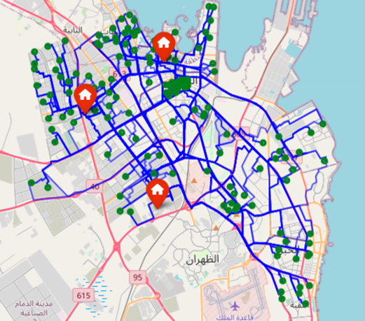
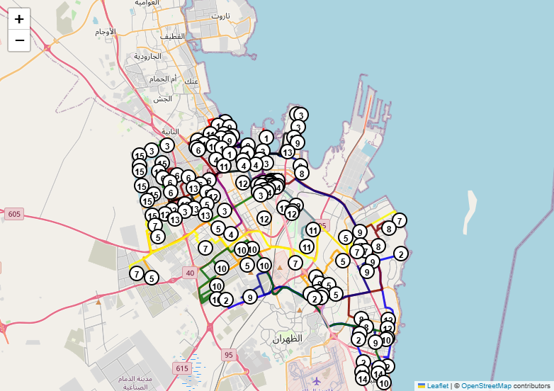

[](https://github.com/ai4smlab/3PL-VRP-Metaheuristics/blob/main/LICENSE)


<div align="center">

# Adaptive Metaheuristic Optimization for 3PL Vehicle Routing

Ahmed Senan, Zead Saleh, Ahmad Al Hanbali, Alaa Khamis

</div>

---

### 🧭 Project Overview

This repository implements an **adaptive metaheuristic optimization framework** for solving the **Multi-Depot Capacitated Vehicle Routing Problem (MD-CVRP)** in the context of **third-party logistics (3PL)** operations.  

It uses **real-world customer demand and urban road network data** from Dammam, Saudi Arabia, and compares the performance of **adaptive vs. non-adaptive** variants of:

- 🔹 **Genetic Algorithm (GA)**
- 🔹 **Simulated Annealing (SA)**

> Adaptive variants improve solution quality and convergence by dynamically adjusting algorithm parameters based on search stagnation and population diversity.

---

### 🧠 Methodology Summary

1. **Problem:**  
   Solve the **MD-CVRP** to minimize total travel distance using multiple vehicles from multiple depots with capacity constraints.

2. **Optimization Algorithms:**  
   - **Non-Adaptive GA / SA:** Fixed parameters.
   - **Adaptive GA / SA:** Adjust parameters during search based on solution performance.

3. **Key Features:**  
   - GeoJSON-based customer locations  
   - Real road distances from OpenRouteService  
   - 146 customers, 3 depots, 15 vehicles (150kg capacity)  
   - Demand range: 5–25 kg per customer

---

### 📊 Performance Comparison

| Algorithm         | Best Distance (km) | Time (s) | Notes                                |
|------------------|--------------------|----------|--------------------------------------|
| Non-Adaptive GA  | 828.73             | 19.76    | Fast convergence, prone to local opt.|
| Adaptive GA      | **811.12**         | 14.22    | Best result with dynamic tuning      |
| Non-Adaptive SA  | 595.24             | 13.10    | Effective with 300 iterations        |
| Adaptive SA      | **565.77**         | 16.32    | Most robust, superior convergence    |

> 🧾 Adaptive SA and GA outperform fixed versions by avoiding early stagnation and improving exploration-exploitation balance.

---

### 🗺️ Data Description

Data file `3pl_data.xlsx` contains the following information:

* Real customer coordinates across Dammam
* Depot locations and vehicle specs
* OpenRouteService-based distances between all nodes


### 🧪 Sample Outputs

**Real-world routes BY OpenRouteService (ORS)**  


**Real-road routing for adaptive SA with 300 iterations.**  


---

### ⚙️ Reproducibility

- 📘 **Notebook:**  
  [`3PL_Metaheuristics_Routing.ipynb`](3PL_Metaheuristics_Routing.ipynb)

- 📦 **Dependencies:**  
  `numpy`, `pandas`, `geopandas`, `matplotlib`, `openrouteservice`, `networkx`, `folium`

---

### 🔍 Key Findings

✅ Adaptive metaheuristics reduce total distance by **5–10%** vs. non-adaptive  
✅ Adaptive SA achieved **lowest route cost** (565.77 km)  
✅ Adaptive GA provided **consistent performance** across population sizes  
✅ Framework scales well and is based on real logistics constraints  

---

### 🔖 Citation

If you use this work or data, please cite:

Plain text (IEEE):

Senan, A., Saleh, Z., Al Hanbali, A., & Khamis, A., "Adaptive Metaheuristic Optimization of Multi-Depot Capacitated Vehicle Routing for Third-Party Logistics," submitted to *IEEE International Conference on Smart Mobility*, 2026.

BibTeX:
```bibtex
@article{senan2026adaptive,
  title   = {Adaptive Metaheuristic Optimization of Multi-Depot Capacitated Vehicle Routing for Third-Party Logistics},
  author  = {Senan, Ahmed and Saleh, Zead and Al Hanbali, Ahmad and Khamis, Alaa},
  journal = {Submitted to IEEE International Conference on Smart Mobility},
  year    = {2026}
}
```

---

### 🏁 Acknowledgment

Research conducted at **KFUPM** in collaboration with **UBT**, utilizing real-world data from Dammam, Saudi Arabia. Route distances provided by **OpenRouteService**, based on **OpenStreetMap**.
